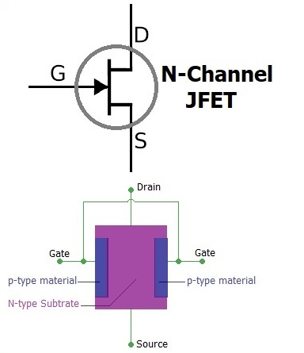

## Procedure

  
**Fig. 1. JFET Construction, Working and Biasing**

  

**Steps to perform the real measurement in HP 4145B Semiconductor Parameter Analyzer**  

Equipment and Components
------------------------

*   n-channel JFET (e.g., 2N5457 or similar)
*   DC power supply
*   Digital multimeters
*   Function generator (if available)
*   Resistors (for limiting current and setting up the circuit)
*   Breadboard and connecting wires
*   Oscilloscope (optional, for advanced analysis)

Circuit Diagram
---------------

The experimental setup consists of a basic circuit to measure the output characteristics of the n-channel JFET. The circuit is as follows:

1.  Connect the source terminal of the JFET to the ground.
2.  Connect a variable DC power supply between the drain and source terminals, allowing control of the drain-source voltage ($$V_{DS}$$).
3.  Insert a resistor (RD) in series with the drain terminal to limit the current and measure the drain current ($$I_D$$) indirectly.
4.  Connect the gate terminal to another variable DC power supply to adjust the gate-source voltage ($$V_{GS}$$).

Procedure
---------

### Setup the Circuit

Assemble the circuit on a breadboard as per the circuit diagram. Ensure all connections are secure and check the polarity of the power supplies.

### Initial Calibration

1.  Set the gate-source voltage ($$V_{GS}$$) to zero volts ($$V_{GS}$$ = 0V).
2.  Adjust the drain-source voltage ($$V_{DS}$$) using the power supply and measure the corresponding drain current ($$I_D$$) using a digital multimeter. Record the values.

### Varying $$V_{DS}$$

Incrementally increase $$V_{DS}$$ from 0V to a higher value (e.g., 20V) in small steps (e.g., 1V or 2V). For each $$V_{DS}$$ value, measure and record the corresponding $$I_D$$.

### Varying $$V_{GS}$$

Repeat the above steps for different values of VGS (e.g., -1V, -2V, -3V). For each VGS value, vary $$V_{DS}$$ and record the corresponding $$I_D$$.

### Data Analysis

Plot the drain current ($$I_D$$) versus drain-source voltage ($$V_{DS}$$) for each value of gate-source voltage ($$V_{GS}$$) on a graph. Identify the different regions of operation (ohmic, active, and cutoff regions) from the plotted curves.

Observations
------------

*   In the **ohmic region**, the $$I_D$$ increases linearly with $$V_{DS}$$ for small values of $$V_{DS}$$, indicating that the JFET operates like a variable resistor.
*   In the **active region**, the $$I_D$$ reaches a saturation point and becomes relatively independent of $$V_{DS}$$, indicating the current saturation behavior of the JFET.
*   In the **cutoff region**, for sufficiently negative $$V_{GS}$$ values, the $$I_D$$ approaches zero, indicating that the JFET is off.

Conclusion
----------

From the experiment, the output characteristics of the n-channel JFET were successfully measured and analyzed. The $$I_D$$ vs. $$V_{DS}$$ curves for different VGS values provide insight into the device's behavior under varying conditions. The JFET's operation was observed in the ohmic, active, and cutoff regions, confirming the theoretical expectations.

Precautions
-----------

*   Ensure the JFET is not exposed to excessive $$V_{DS}$$ or $$V_{GS}$$ to avoid damage.
*   Use appropriate resistor values to limit the current and prevent overheating.
*   Double-check all connections before powering the circuit to prevent short circuits or incorrect measurements.

Further Experiments
-------------------

*   Investigate the effect of temperature on the output characteristics of the n-channel JFET.
*   Compare the output characteristics of different n-channel JFET models.
*   Analyze the noise performance and input impedance variations with different operating points.
