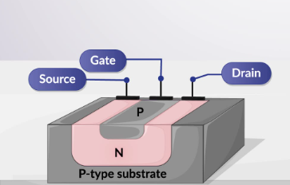

## Theory
**Introduction:**  
The n-channel Junction Field Effect Transistor (JFET) is a type of FET where the current conduction is due to electrons, making it a unipolar device. The operation of an n-channel JFET relies on the control of the current flowing through a channel of n-type semiconductor material by the voltage applied to the gate terminal. The primary regions of operation are determined by the relationship between the gate-source voltage ($$V_{GS}$$) and the drain-source voltage ($$V_{DS}$$), influencing the device's output characteristics.

**Fig. 1. Threshold Voltage and Inversion charge**

Structure and Operation
-----------------------

An n-channel JFET consists of a channel of n-type semiconductor material with p-type regions diffused on either side, forming p-n junctions. These p-type regions are connected to the gate terminal, while the n-type channel connects the source and drain terminals. When a voltage is applied between the drain and source ($$V_{DS}$$), electrons flow from the source to the drain, constituting the drain current ($$I_D$$).

Gate-Source Voltage ($$V_{GS}$$) Influence
-----------------------------------

The gate-source voltage ($$V_{GS}$$) is crucial in controlling the channel's conductivity. For an n-channel JFET, a negative VGS depletes the channel of electrons, reducing the current flow. When $$V_{GS}$$ is zero, the JFET operates at its maximum current for a given $$V_{DS}$$. As $$V_{GS}$$ becomes more negative, the channel narrows, restricting the current flow until the channel is completely pinched off, and the current becomes minimal.

Regions of Operation
--------------------

### Ohmic (Linear) Region

*   In this region, the JFET operates like a variable resistor. The $$V_{DS}$$ is low, and the channel is uniformly conductive.
*   The drain current ($$I_D$$) increases linearly with an increase in $$V_{DS}$$.
*   The relationship can be approximated by Ohm's law: $$I_D$$ ≈ $$V_{DS}$$ / RDS(on), where RDS(on) is the on-resistance of the JFET.

### Active (Saturation) Region

*   As VDS increases, the channel near the drain end starts to pinch off when the voltage at the drain end of the channel equals the gate voltage plus the pinch-off voltage (VP).
*   The current ID saturates and becomes relatively independent of VDS. The JFET enters the saturation region where $$I_D$$ is controlled by $$V_{GS}$$ and is given by:
    
    $$I_D = I_{DSS} (1 - V_{GS} / V_P)^2$$
    
    where IDSS is the drain-source saturation current and VP is the pinch-off voltage.
    

### Cutoff Region

*   When $$V_{GS}$$ is sufficiently negative, the channel is fully depleted, and the JFET is off. The drain current ($$I_D$$) is almost zero.

### Breakdown Region

*   If VDS exceeds a certain critical value, the JFET enters the breakdown region where the drain current increases rapidly with a small increase in VDS. This is due to avalanche breakdown of the p-n junctions and can potentially damage the device.

Output Characteristics Curves
-----------------------------

The output characteristics of an n-channel JFET are graphically represented by plotting the drain current ($$I_D$$) against the drain-source voltage ($$V_{DS}$$) for various gate-source voltages ($$V_{GS}$$). The typical output characteristics curves can be divided into different regions as described above, showing how $$I_D$$ varies with VDS for different VGS levels. These curves illustrate the JFET's behavior under different operating conditions and are essential for circuit design and analysis.

Mathematical Model
------------------

The mathematical model for the output characteristics in the active region is given by the Shockley equation:

$$I_D = I_{DSS} (1 - V_{GS} / V_P)^2$$

where $$I_{DSS}$$ is the drain-source saturation current when $$V_{GS}$$ = 0, and VP is the pinch-off voltage. This quadratic relationship highlights the sensitivity of $$I_D$$ to changes in $$V_{GS}$$, emphasizing the importance of gate control in JFET operation.

In summary, the theory behind the output characteristics of an n-channel JFET involves understanding the influence of VGS and VDS on the drain current ($$I_D$$). By analyzing the different regions of operation and their corresponding behavior, one can effectively utilize the n-channel JFET in various electronic applications, ensuring optimal performance and reliability.

The expression for the drain current of a n-channel JFET in the linear regime is,

$$\\begin{equation} I\_D=I\_p\\left\[\\frac{V\_D}{V\_p}-\\frac{2}{3}\\left(\\frac{V\_{bi}+V\_D-V\_G}{V\_p}\\right)^{3/2}+\\frac{2}{3}\\left(\\frac{V\_{bi}-V\_G}{V\_p}\\right)^{3/2}\\right\], \\end{equation}$$

where,

$$\\begin{align} I\_p =\\frac{\\mu\_n {N\_D}^2 Z e^2 h^3}{2L\\epsilon\_r\\epsilon\_0} \\qquad V\_p =\\frac{e {N\_D} h^2}{2 \\epsilon\_r\\epsilon\_0} \\qquad eV\_{bi} =k\_B T \\ln \\left(\\frac{N\_A N\_D}{{n\_i}^2}\\right) \\qquad n\_i=\\sqrt{N\_cN\_v\\left(\\frac{T}{300}\\right)^{3}}\\exp\\left(\\frac{-E\_g}{2k\_BT}\\right). \\end{align}$$

In the saturation regime the current is,

$$ \\begin{equation} I\_D=I\_p\\left\[\\frac{1}{3}-\\frac{V\_{bi}-V\_G}{V\_p}+\\frac{2}{3}\\left(\\frac{V\_{bi}-V\_G}{V\_p}\\right)^{3/2}\\right\]. \\end{equation}$$

These expressions are valid assuming that the pn junction is reverse biased. For a n-channel JFET, $$GV_G$$ < 0 and $$V_D$$ > 0 in this regime.

       
 
